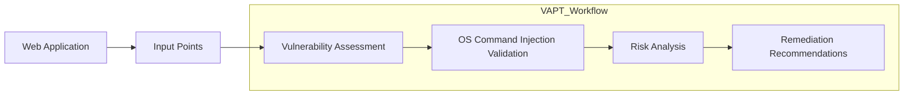

```mermaid
flowchart LR
    A["Web Application"] --> B["Input Points"]
    B --> C["Vulnerability Assessment"]
    C --> D["OS Command Injection Validation"]
    D --> E["Risk Analysis"]
    E --> F["Remediation Recommendations"]

    subgraph VAPT_Workflow
        C
        D
        E
        F
    end
```
